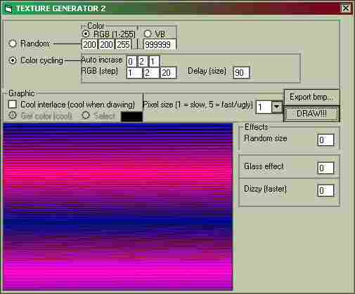



## TEXTURE GENERATOR 2\!\!\! VERY COOL TEXTURE MAKING PROGRAM WITH EFFECTS\!\!\!

### Description

You can make cool textures with this program!

Please vote if you like it!
 
### More Info
 

             |
---                |---
**Submitted On**   |2000-10-09 18:00:30
**By**             |[Johannes B](https://github.com/Planet-Source-Code/PSCIndex/blob/master/ByAuthor/johannes-b.md)
**Level**          |Intermediate
**User Rating**    |4.6 (23 globes from 5 users)
**Compatibility**  |VB 5\.0, VB 6\.0
**Category**       |[Graphics](https://github.com/Planet-Source-Code/PSCIndex/blob/master/ByCategory/graphics__1-46.md)
**World**          |[Visual Basic](https://github.com/Planet-Source-Code/PSCIndex/blob/master/ByWorld/visual-basic.md)
**Archive File**   |[CODE\_UPLOAD1058710112000\.zip](https://github.com/Planet-Source-Code/johannes-b-texture-generator-2-very-cool-texture-making-program-with-effects__1-11967/archive/master.zip)

